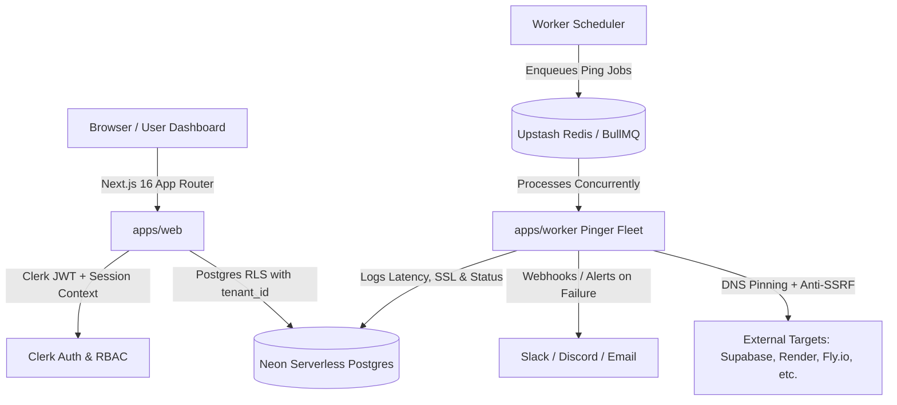

# Pyra — Keep-Alive & High-Availability Synthetic Monitoring

[](https://github.com/Hazy019/pyra-keep-alive/actions)
[](https://www.typescriptlang.org/)
[](https://nextjs.org/)
[](https://neon.tech/)
[](LICENSE)

**Pyra** is a high-availability, platform-agnostic keep-alive and synthetic uptime monitoring platform. It is engineered specifically to prevent container sleep, database scale-to-zero, cold starts, and inactive project pausing across modern cloud providers (Supabase, Render, Fly.io, Railway, Cloudflare Workers, Neon, and Vercel).

---

## Architecture Overview



### Monorepo Structure

```
pyra/
├── apps/
│   ├── web/        # Next.js 16 App Router (Marketing, Dashboard, Billing, REST API)
│   └── worker/     # Fastify + BullMQ distributed keep-alive execution engine
├── packages/
│   ├── db/         # Drizzle ORM schema, migrations, and tenant RLS policies (Neon Postgres)
│   └── shared/     # SSRF defense, AES-256-GCM encryption, tamper-evident audit writer, shared types
├── .github/
│   ├── workflows/  # CI pipelines (lint, typecheck, unit tests, RLS tests, security audit)
│   └── dependabot.yml
└── .env.example    # Environment variable template
```

---

## Plans & Pricing Architecture

Pyra operates on a clear two-tier model engineered to balance accessible developer hobby keep-alives with high-concurrency enterprise workloads:

| Capability | Free Tier ($0/mo) | Team Plan ($12/seat/mo) |
|---|---|---|
| **Max Endpoints** | 3 endpoints per workspace | Up to 50 endpoints per workspace |
| **Ping Cadence** | 5 minutes (prevents container sleep) | **60 seconds (verified high-frequency)** |
| **Alert Channels** | Email notifications | **Slack, Discord, and Custom Webhooks** |
| **Data Retention** | 30-day ping & audit history | **90-day ping & audit telemetry** |
| **Isolation & RBAC**| Postgres Row-Level Security | **Team RBAC (`owner`, `admin`, `member`, `viewer`)** |
| **SLA & Routing** | Standard edge routing | **Priority queueing & dedicated SLAs** |

### Plan Enforcement & Billing

- **API Enforcement**: All endpoint additions and interval edits (`/api/targets`) enforce quotas within database transactions. Attempting to schedule intervals below the tier minimum or exceeding target counts returns immediate, structured `400` / `429` error envelopes.
- **In-App Billing Portal**: Located at `/dashboard/billing`, workspace owners can view real-time quota meters, audit recent invoices, and seamlessly upgrade/downgrade subscription tiers with automated cryptographic audit trail logging (`billing.plan_upgraded`, `billing.plan_downgraded`).

---

## Security Architecture & Guarantees

Pyra treats security as a core architectural primitive rather than an afterthought:

1. **Anti-SSRF Protection (Server-Side Request Forgery)**
   - All URLs undergo RFC 1918, RFC 3927 (link-local), loopback (`127.0.0.0/8`, `::1`), and AWS metadata IP (`169.254.169.254`) filtering.
   - Dual-resolution DNS pinning ensures that the IP validated at schedule time matches the exact IP pinged by the worker fleet, neutralizing DNS rebinding attacks.

2. **Cryptographic Multi-Tenant Row-Level Security (RLS)**
   - PostgreSQL Row-Level Security is strictly enforced across all database tables (`tenants`, `users`, `memberships`, `targets`, `ping_logs`, `audit_log`).
   - Every database session executes `SET LOCAL app.current_tenant_id = '<tenant_uuid>'`, ensuring queries are physically and cryptographically prevented from accessing cross-tenant data.

3. **Envelope Credential Encryption (AES-256-GCM)**
   - Target authentication headers and Supabase service/anon keys are encrypted using AES-256-GCM with per-entry random 96-bit initialization vectors (IVs) and authentication tags before persistence. Cleartext credentials never hit the database.

4. **Tamper-Evident SHA-256 Hash-Chained Audit Trail**
   - Critical workspace events (target creation, credential updates, plan upgrades, role assignments) are recorded to an append-only audit log.
   - Each log entry cryptographically links to the previous row's SHA-256 hash (`prev_hash` -> `row_hash`), creating a verifiable Merkle-style chain of custody.

---

## Getting Started

### Prerequisites

- **Node.js**: `v20.x` or `v22.x`
- **pnpm**: `v9.x` (`npm install -g pnpm`)
- **Neon Database**: Free serverless PostgreSQL account ([neon.tech](https://neon.tech))
- **Clerk**: Authentication account ([clerk.com](https://clerk.com))
- **Upstash Redis**: Serverless Redis for BullMQ queues ([upstash.com](https://upstash.com))

### Installation & Local Setup

```bash
# 1. Clone the repository
git clone https://github.com/Hazy019/pyra-keep-alive.git
cd pyra-keep-alive

# 2. Install workspace dependencies
pnpm install

# 3. Configure environment variables
cp .env.example .env.local
# Edit .env.local with your Neon DATABASE_URL, Clerk, and Upstash keys

# 4. Apply database schema and migrations
pnpm db:push

# 5. Start the Next.js development server (runs on http://localhost:3000)
pnpm dev:web

# 6. (Optional) Run the distributed pinger worker locally
pnpm dev:worker
```

---

## Verification & Testing Suite

Pyra maintains strict CI gates and test suites:

```bash
# Run strict TypeScript verification across all apps and packages
pnpm typecheck

# Run unit tests and PostgreSQL Row-Level Security isolation tests
pnpm test

# Run specific tenant isolation test suite
pnpm --filter @pyra/db test:rls

# Run Next.js linting
pnpm lint
```

---

## API Surface

| Endpoint | Method | Role Required | Description |
|---|---|---|---|
| `/api/targets` | `GET` | `viewer` | List all monitored targets for the authenticated tenant |
| `/api/targets` | `POST` | `member` | Create a new target (validates SSRF, plan quota, and interval) |
| `/api/targets/[id]` | `PATCH` | `admin` | Update target URL, auth credentials, ping interval, or active state |
| `/api/targets/[id]` | `DELETE`| `admin` | Cascade delete a target and its associated ping telemetry |
| `/api/targets/[id]/verify` | `POST` | `member` | Verify domain ownership to unlock high-frequency 1m intervals |
| `/api/billing/plan` | `GET` | `viewer` | Get current plan, limits, and endpoint utilization quota |
| `/api/billing/plan` | `PATCH` | `admin` | Switch workspace plan (Free ↔ Team) with audit logging |
| `/api/health` | `GET` | Public | System liveness probe |

---

## License

Distributed under the MIT License. See [LICENSE](LICENSE) for details.
